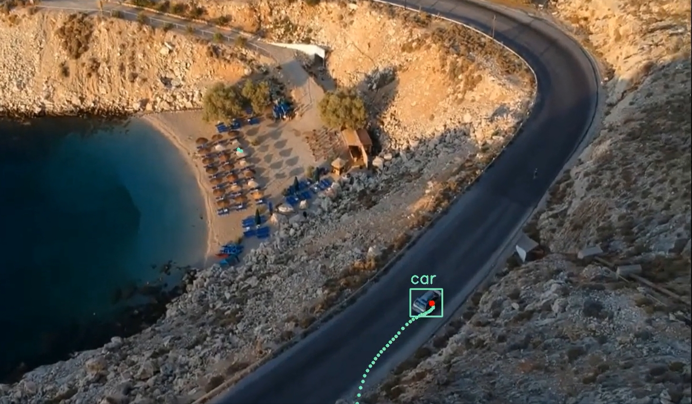
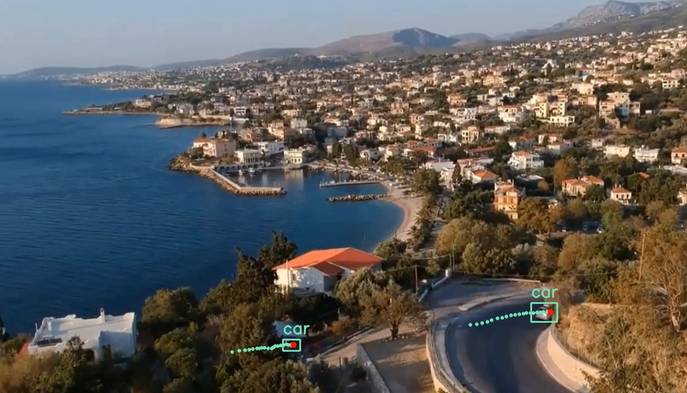
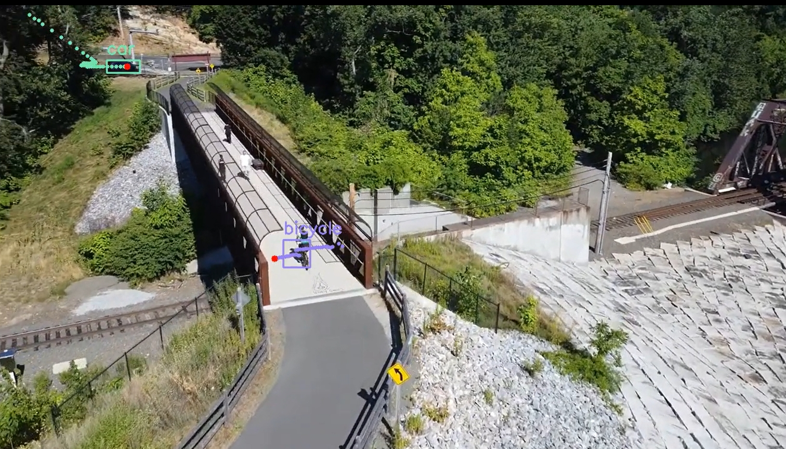
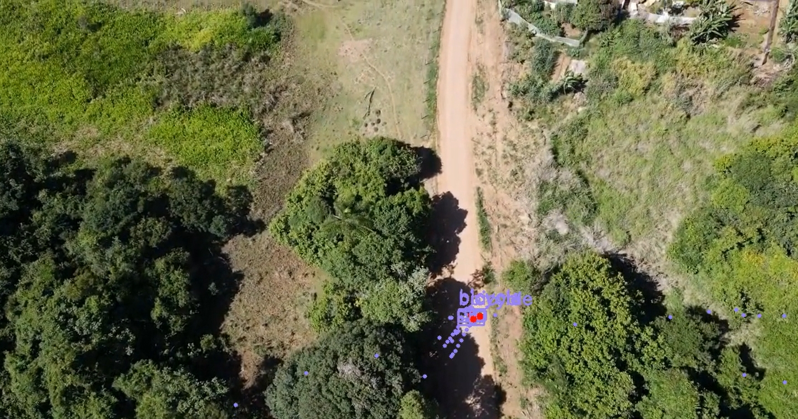

- Codes are in `main.ipython`
- Sample Results (Click the image to watch in youtube)

[](https://youtu.be/HR3QH3iTXAU)

0: Docker Environment setup
--
- Set up environment in `docker-compose.yml` and run 
```
docker build
```

- When the build is compelete, run:
```
docker-compose up -d
```

- Attach the environment to VSCode. And redirect to the work directory

- Upgrade jupyterlab by:
```
pip install jupyterlab --upgrade
```

- Initiate Jupyter Lab by running the follwing command and open the generated link in the browser.
```
jupyter lab --ip=0.0.0.0 --port=8888 --no-browser --allow-root
```

1: Object Detection & Fintuning
--
### 1.1 Download YouTube Videos
- Exploit `pytube` API in `download_video(url, output_path='videos')` to download videos
- Example useage:
```
youtube_url = 'https://youtu.be/5dRramZVu2Q'
download_video(youtube_url)
```

### 1.2 Download [Visdrone](https://github.com/VisDrone/VisDrone-Dataset)
- Using the traning set of  `Object Detection in Images`
```
!pip install gdown
!gdown 'https://drive.google.com/uc?id=1a2oHjcEcwXP8oUF95qiwrqzACb2YlUhn'
!unzip VisDrone2019-DET-train.zip
```
- Visdrone dataset
	- Annotation: in `.txt` files, each line of each file repesent the following
```
bbox_left, bbox_top, bbox_widrh, bbox_height, score, label, truccation, occlusion
```
	-  In lable:
		- 0: background   - 1: pedestrian   - 2: people   - 3: bicycle  - 4: car    - 5: van
		- 6: truck  - 7: tricycle  - 8: awning-tricycle  - 9: bus   - 10: motor
### 1.3 Prepare Custom dataset traning dataset
- Inherit `Dataset` in pytorch as `VisDroneDataset`
- Filter images and bounding boxes with `bicycle` and `car` using  `parse_annotation(self, annotation_path)`
- Image and bounding box need to be resized to perfrom batch traning
- Example of loading dataset
```
train_dataset = VisDroneDataset(img_dir=img_dir, ann_dir=ann_dir, transform=None)
data_loader = DataLoader(train_dataset, batch_size=4, shuffle=False, collate_fn=collate_fn)
```

### 1.4 Finetune Faster R-CNN model
- Loading pretrined faster rcnn model in pytorch are warpped in `get_model(num_classes)` (num_classes is 3 for bicycle, car and background)
- The traning process are warpped in `train_model(model, data_loader, device, num_epochs)`
- Example of fintuning the model
```
num_epochs = 19
num_classes = 3
device = torch.device('cuda') if torch.cuda.is_available() else torch.device('cpu')
model = get_model(num_classes)
train_model(model, data_loader, device, num_epochs)
```
- Checkpoint can be downloaded [here](https://drive.google.com/file/d/1okY3C0KB0pJ9qVbUdB-PjoDQaxHcM0kA/view?usp=sharing)

### 1.5 Load the fintune model for inference
- Loading the fintuned model from checkpoint are wrapped in  `load_model_for_inference(path, device)`
- Infernece are wrapped in `inference(model, image, score_threshold_bi, score_threshold_car)`, return the filtered detection results. Use different threshold for `bicycle` and `car` class respectively, since the confidence score for `bicycle` tend to be lower

2: Kalman Filter
--
### 2.1  Initialize a kalman filter for each traget object, including
- Initializes an instance of a Kalman filter using `initialize_kalman()`
- Setting the filter's initial state, state transition matrix, measurement matrix, process noise covariance, measurement noise covariance, and initial error covariance
- Include `missed_count` to handle ***false positive***, in the follwing process, once the `missed_count` is over certain threshold, the tracker will be deleted
### 2.2 Assign detections to existing trackers using the Hungarian algorithm
- Compute the cost matrix via `compute_cost_matrix(detections, trackers,adjusted_boxes_resized)` based on IoU metric and Euclidean distance of the detected centroids
- Assigns detections to existing trackers using the Hungarian algorithm, minimizing the overall cost. This is wrapped in `assign_detections_to_trackers`
### 2.3 Update trackers
- Update the state of the trackers based on the new detections or create new trackers using `update_trackersupdate_trackers(trackers, adjusted_boxes_resized, pred_scores, row_ind, col_ind, pred_labels)`
- Increase the `missed_count` for unassigned tracker to erase false positive

## 2.4 Visualize the trace and detection results in frame
- The visualization process are wrapped in `visualize_frame(frame, boxes, scores, labels, trackers)`
- Using different color to plot the trace and bounding box for differnt classes. Draw 80 most recent points as trace only because change of the scene
- Plot the predict point in `red`

3: Multi-object Tracking in videos
--
### 3.1 Pipeline
- Read and write the image using `imageio`, with frame rate of `20`
```
video_reader = imageio.get_reader(video_path)  ## read video
writer = imageio.get_writer(output_filename, fps=20)
writer.append_data(vis_frame)
writer.close()
```
- Load the fintuned detection model
- Object tracking using kalman filter
	- Perfrom object dtection in each frame
		- Filter the `bicycle` and `car` class with threshold of  `0.4`  and `0.9` respetively
	- Associated with existing trackers or initialize new trackers using the detections
	- The Kalman filter `predict` method is called for each tracker to estimate the new state
		- Trackers that haven't been updated in the last 20 frames are removed to maintain tracking accuracy
	- The current frame is annotated with detection and tracking information and added to the output video

### 3.2 Result display
- Cyclist and vehicle 1
- Cyclist and vehicle 2
- Drone tracking 
- Cyclists 
